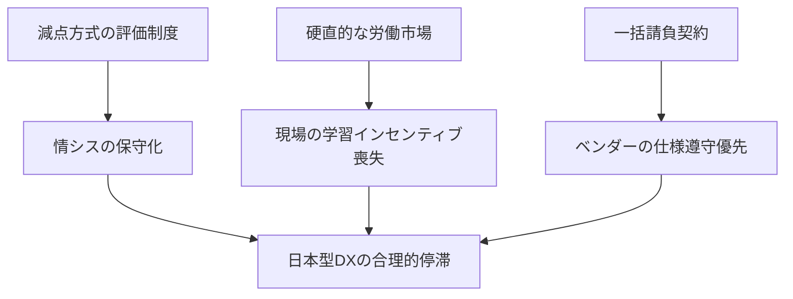

# portfolio
構造分析のポートフォリオ用リポジトリ

構造分析レポート：なぜ日本企業のDXは「合理的」に停滞するのか

本リポジトリは、日本企業におけるDX停滞を「個人の怠慢」ではなく「組織構造の必然」として捉え、その構造を解き明かすことで、現場のリーダーが上層部を説得し、変革を推進するための分析資料を体系的にまとめることを目的としています。DXが進まない理由を精神論や意識論に還元せず、観測可能な現象と構造的要因に基づいて説明することで、再現性のある理解と改善のための基盤を提供します。

観測される三つの構造的現象
DX停滞は、以下の三つの客観的な構造として観測できます。いずれも個人の能力や意識ではなく、制度・責任・契約といった仕組みが生み出す合理的行動として説明されます。

1. 「99点で即アウト」の責任構造（安全性：情シス部門）
情シス部門が新技術導入に慎重になるのは保守的な性格ではなく、配置されている責任構造の非対称性による合理的判断です。

観測可能な事象：クラウドやゼロトラストの導入見送り、レガシー維持コストの増大

構造的視点：安定稼働（100点）が当然とされ、減点のみが評価に直結する一方で、刷新による加点評価が存在しない

一意性：個人の「ITリテラシー」ではなく、失敗許容度ゼロの評価軸という構造的制約として定義

2. 「沈黙」を選択させる経済的インセンティブ（評価：現場）
現場がDXに非協力的なのは主体性の欠如ではなく、挑戦のリスクとリターンが釣り合わないという経済的合理性に基づきます。

観測可能な事象：DXプロジェクトの形骸化、改善提案の減少、新ツール習得に伴うサービス残業や摩擦コスト

構造的視点：年功序列・一律給与の下で、学習コストは個人負担だが成果による報酬増はなく、失敗時の減点のみが存在する

一意性：「意識が低い」ではなく、挑戦コストがリターンを上回る合理的な非行動として定義

3. 「仕様通り」を正解とする契約の壁（契約：ベンダー関係）
使いにくいシステムが量産されるのはベンダーの質ではなく、一括請負契約がもたらす構造的必然です。

観測可能な事象：現場負荷を増やすシステムの納品、仕様外改善の拒絶、業務目的の欠落

構造的視点：一括請負契約と瑕疵担保責任により、ベンダーにとって最も低リスクなのは「仕様書通りの納品」であり、ビジネス成果より契約不履行回避が優先される

一意性：「ベンダーの質が低い」ではなく、契約形態が仕様遵守へ最適化させる構造として定義

全体構造の可視化
以下は、日本企業のDXが「合理的に」停滞する構造を因果関係として整理した図です。

### 構造の可視化

本リポジトリで扱う内容
今後、このリポジトリでは上記三つの構造を軸に、DX停滞の背景にある制度・評価・契約のメカニズムを分析し、現場リーダーが上層部を説得するための資料や構造図、論理モデルを体系的に整理していきます。
