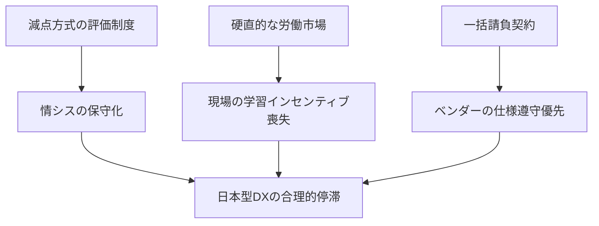

# 構造分析ポートフォリオ  
## 日本企業のDXはなぜ「合理的に」停滞するのか

本リポジトリは、日本企業における DX 停滞を「個人の怠慢」ではなく  
**制度・評価・契約が生み出す構造的必然**として捉え、その因果関係を可視化することを目的としています。

精神論や意識論に依存せず、**観測可能な現象**と**構造的要因**に基づいて説明することで、  
現場リーダーが上層部を説得し、改善に着手できるための再現性ある分析基盤を提供します。

---

## 📁 リポジトリ構成

| ファイル名 | 内容 | 想定読者・用途 |
|-----------|------|----------------|
| [proposal-slide.pdf](proposal-slide.pdf) | 構造分析スライド（全体像の要約） | 最初に読む資料。構造の俯瞰を短時間で把握したい経営層・第三者向け |
| [roadmap.md](roadmap.md) | DX構造改革：最初の90日間ロードマップ | 「明日から何をすべきか」を示す初動タスク一覧。提言の実行フェーズ |
| [qa.md](qa.md) | 経営層向け想定問答（Q&A） | 典型的な反論に対する“構造論としての理想形の回答例”。対話モデル |
| [report.md](report.md) | 構造分析レポート（本文） | 停滞の三角形・三つの構造の詳細分析。最も深い内容を扱う基礎資料 |

---

## 🧩 DX 停滞を生む三つの構造的現象  
DX が進まない理由は、個人の能力や意識ではなく、  
**制度・責任・契約が生み出す合理的行動**として説明できます。

---

### 1. 「99点で即アウト」の責任構造（情シス部門）

#### 観測可能な事象
- クラウド・ゼロトラスト導入の見送り  
- レガシー維持コストの増大  

#### 構造的視点
安定稼働（100点）が当然とされ、  
**減点のみが評価に直結し、刷新による加点が存在しない非対称な責任構造**。

#### 一意性
「ITリテラシーの低さ」ではなく、  
**失敗許容度ゼロの評価軸**という構造的制約。

---

### 2. 「沈黙」を選択させる経済的インセンティブ（現場）

#### 観測可能な事象
- DX プロジェクトの形骸化  
- 改善提案の減少  
- 新ツール習得に伴うサービス残業・摩擦コスト  

#### 構造的視点
年功序列・一律給与の下で、  
**学習コストは個人負担だが、成果による報酬増はなく、失敗時の減点のみが存在**。

#### 一意性
「意識が低い」のではなく、  
**挑戦コストがリターンを上回る合理的な非行動**。

---

### 3. 「仕様通り」を正解とする契約の壁（ベンダー関係）

#### 観測可能な事象
- 現場負荷を増やすシステムの納品  
- 仕様外改善の拒絶  
- 業務目的の欠落  

#### 構造的視点
一括請負契約と瑕疵担保責任により、  
**ベンダーにとって最も低リスクなのは「仕様書通りの納品」**であり、  
ビジネス成果より契約不履行回避が優先される。

#### 一意性
「ベンダーの質が低い」のではなく、  
**契約形態が仕様遵守へ最適化させる構造**。

---

## 🔍 全体構造の可視化

DX が「合理的に」停滞する構造を因果関係として整理した図を以下に掲載しています。

## 📚 本リポジトリで扱う内容

本リポジトリでは、上記三つの構造を軸に、  
DX 停滞の背景にある **制度・評価・契約のメカニズム** を分析し、  
現場リーダーが上層部を説得するための資料・構造図・論理モデルを体系的に整理します。

---

## 📝 ライセンス

本リポジトリの内容は、著者の許可なく商用利用・転載を禁止します。  
研究・教育目的での引用は出典を明記した上でご利用ください。

