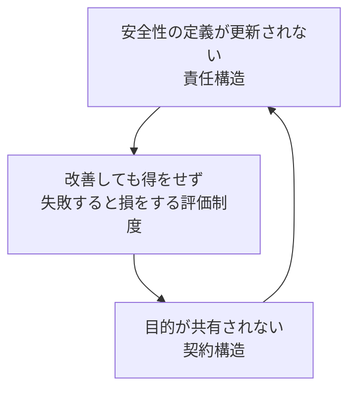

# 構造分析レポート：なぜ日本企業のDXは“合理的に”進まないのか

日本の会社でDXを担当していると、現場の努力とは裏腹に変化が進まない状況に直面することがあります。提案は慎重に扱われ、システムは使いにくく、改善のための議論は途中で止まり、最終的には「今のままでいい」という空気が組織全体を覆っていきます。
本レポートは、この停滞を個人の怠慢ではなく、組織に埋め込まれた構造によって説明するためのものです。
対象は、現場でDXの実務を担いながらも意思決定権が限定され、上層部を説得する材料を求めているリーダー層・担当者です。
DXが進まない背景には、三つの構造的欠陥が存在します。

第一に、安全性の定義が古いまま固定され、社内ネットワーク内だけが安全と見なされるため、クラウド化やゼロトラストといった新しい手段が常に“危険”と判断されます。
第二に、改善しても得をせず、失敗すると損をする評価制度が、現場に「動かない方が合理的」という判断を強いる構造を生み出しています。
第三に、ベンダーとユーザーの目的が共有されず、要件定義が機能の羅列に終始することで、現場の負荷を増やすシステムが量産されます。
これら三つの構造は独立しているわけではなく、互いに強化し合う「停滞の三角形」を形成しています。
図にするなら、三つの頂点に「古い安全性の定義」「変化を罰する評価制度」「目的が共有されない発注構造」を置き、それぞれを矢印で結びます。
安全性の定義が古いほどクラウド化が遅れ、成果が出ず評価制度が変わらない。評価制度が変わらないほど現場は改善にコミットせず、要件定義が浅くなる。
要件定義が浅いほど使いにくいシステムが生まれ、DXへの不信感が強まり、安全性名目で現状維持が正当化される。三つの矢印が円環を描き、どの方向に回しても停滞が自己強化される構造です。

重要なのは、この停滞が「非合理」ではなく、むしろ各主体が自分の立場で最適に行動した結果として生じているという点です。
情シスは責任回避のために慎重になり、現場は評価制度の下で沈黙を選び、ベンダーは契約通りの機能提供に集中する。どれも個々人にとっては合理的な判断でありながら、全体としては最悪の結果──DXの停滞──を生み出す。
これは典型的な「合成の誤謬」であり、個人の意識改革では解決しない構造問題です。
この全体像を踏まえ、次章以降では三つの構造欠陥を順に分解し、どの部分に手を入れれば停滞のループが崩れるのかを明らかにしていきます。

## 第1章　安全性の定義が更新されない構造：なぜ新技術は“合理的に”拒絶されるのか

日本企業でクラウド化やゼロトラストを提案すると、情シスが慎重な姿勢を示し、最終的には「今回は見送ろう」という結論に落ち着く場面が少なくありません。
この現象を「情シスが頭が固い」と個人の性質で説明してしまうと、問題の本質を見誤ります。実際には、情シスが置かれている**責任構造**が、彼らに「新しい手段を採用しない」という判断を強制しているのです。

情シスの評価軸は極端な非対称性を持っています。
システムが安定して稼働している状態は“当たり前”とされ、どれだけ運用を改善しても加点はほとんどありません。
一方で、小さな障害やセキュリティ事故が発生した瞬間、責任は情シス個人に集中し、評価の低下や配置転換といった形で跳ね返ってきます。
つまり、情シスは「100点が標準で、99点を取った瞬間に即アウト」という構造の中に置かれているのです。
この非対称性は、新技術に対する判断を大きく歪めます。
未知の技術は、評価できないリスクを含むため、情シスにとっては“失点確率の高い選択肢”になります。
クラウド化やゼロトラストは、外部サービスとの接続や新しい運用モデルを伴うため、従来の「社内ネットワーク内＝安全」という前提から外れます。
すると責任構造は、情シスに「新技術＝危険」「現状維持＝安全」という判断を合理的に選ばせます。
さらに、経営層のITリテラシー不足がこの構造を補強します。
経営層は技術的判断を情シスに丸投げするため、情シスは「判断権限はあるが、責任はすべて自分に降りかかる」という状態に置かれます。
判断の根拠を共有できる相手がいないため、情シスはより保守的な選択に傾きます。

ここに、多重下請け構造が重なります。日本のSIerモデルでは、実際に手を動かすのは末端の下請けであり、上流のベンダーも情シスも、自前で安全性を評価する能力を持ちにくい構造になっています。
未知の技術を採用するほど、評価不能な領域が増え、責任リスクが跳ね上がります。
結果として、「知らないものは危険」「使ったことがあるものが安全」という判断が制度的に強化されます。
これらの要素がつながると、因果のループが生まれます。
責任構造が情シスに失点回避を最優先させるため、新技術は“未知で危険”と判断されます。
新技術が危険と見なされるほど現状維持が最適解になり、技術更新が遅れます。
技術更新が遅れるほど、新技術はさらに“未知で危険”になり、現状維持が強化されます。
こうして「安全性の定義が更新されないほど、更新できなくなる」という強化ループが成立します。

このループの重要な点は、誰も非合理な行動をしていないことです。
情シスは責任構造の中で最も合理的な選択をしており、経営層は判断できない領域を専門部署に委ねているだけで、ベンダーも契約範囲内で安全に仕事を進めています。
しかし、個々の合理性が積み重なることで、組織全体としては「新技術を採用できない」という非合理な結果が生まれます。
これは典型的な合成の誤謬であり、個人の意識改革では解決しない構造問題です。
次章では、この安全性のループと並行して現場を縛るもう一つの構造──「改善しても得をせず、失敗すると損をする評価制度」──を取り上げます。
こちらもまた、個人の怠慢ではなく、制度が行動を強制する構造として理解する必要があります。

## 第2章　改善しても得をせず、失敗すると損をする構造：なぜ現場は“合理的に”沈黙を選ぶのか

DXを推進しようとすると、現場のメンバーが改善提案を出さず、プロジェクトが形骸化していく場面に直面します。
「主体性がない」「挑戦しない」と個人の姿勢を責める声もありますが、この現象を個人の怠慢として扱うと、問題の本質を見失います。
実際には、現場の行動を縛っているのは**一律給与システムと減点評価制度が生み出す構造的な強制力**です。
日本企業の多くでは、給与は年功序列で決まり、成果が直接的に報酬へ反映される仕組みが弱いままです。
この構造の下では、改善に取り組んでも給与は変わらず、役職が上がる保証もありません。一方で、改善には必ず「学習コスト」と「対人摩擦コスト」が伴います。
新しいツールを覚える時間、既存の業務フローを変えるための調整、上司や他部署との摩擦──これらはすべて個人に負担として積み上がります。
しかし、現在の給与制度はこれらのコストを一切補填しません。

さらに、評価制度は減点方式で運用されることが多く、挑戦による失敗は個人の評価低下として跳ね返ってきます。
改善提案がうまくいかなかった場合、その責任は提案者に帰属し、上司との関係が悪化するリスクすらあります。
つまり、現場の担当者は「挑戦すれば損をし、挑戦しなければ損をしない」という構造の中に置かれているのです。
この構造は、現場の行動を合理的に変えていきます。挑戦にはコストがかかり、成功しても報われず、失敗すれば評価が下がる。
すると、最も合理的な行動は「沈黙すること」になります。
改善提案を出さない、余計なことをしない、波風を立てない──これらは怠慢ではなく、制度が最適解として選ばせている行動です。

ここに因果のループが生まれます。
一律給与システムが「挑戦のコスト＞現状維持のコスト」という状態をつくり、現場は改善提案を控えるようになります。
改善提案が減るとDXプロジェクトは形骸化し、成果が出ません。
成果が出ないため、評価制度を変える根拠が生まれず、制度はそのまま維持されます。
制度が維持されることで、挑戦のコストは相対的にさらに高まり、現場はますます沈黙を選ぶようになります。
このループは均衡を保ちながら、現場の行動を固定化していきます。
誰も非合理な行動をしているわけではありません。
現場は制度の中で最も損をしない選択をしており、上司は減点方式の評価制度を踏襲し、経営層は給与制度を大きく変えるリスクを避けています。
しかし、個々の合理性が積み重なることで、組織全体としては「改善が生まれない」という非合理な結果が生じます。
これもまた、個人の意識改革では解決できない構造問題です。
次章では、もう一つの構造──「ベンダーとユーザーの目的が共有されない契約構造」──を取り上げます。
ここでも、主体の怠慢ではなく、契約形態そのものが行動を強制している点を明らかにしていきます。

## 第3章　ベンダーとユーザーの目的が共有されない構造：なぜ“仕様通り”が最適解になってしまうのか

DXプロジェクトが進むにつれ、「使いにくいシステムができた」「要件定義が噛み合わない」「ベンダーが現場を理解してくれない」といった不満が現場から上がります。
これらの現象を「ベンダーが不誠実だから」と個人の姿勢で説明してしまうと、問題の本質を見誤ります。
実際には、ベンダーの行動を決めているのは**契約構造──特に一括請負契約と瑕疵担保責任の仕組み**です。
日本のSIerモデルでは、システム開発の多くが「一括請負契約」で行われます。

この契約形態では、ベンダーは契約書に記載された機能を“仕様通りに”納品する義務を負い、納品後に不具合が見つかれば「瑕疵担保責任」として修正コストを負担することになります。
つまり、ベンダーにとって最もリスクが低い行動は、「仕様書に書かれたことだけを、正確に、過不足なく作る」ことです。

この構造は、ベンダーの行動を大きく制約します。
現場の業務を深く理解し、ユーザーの意図を汲み取り、より良い提案を行うことは、本来であれば価値の高い行動です。
しかし、一括請負契約の下では、仕様書に書かれていない“余計な提案”は、後のトラブルの火種になります。
提案した結果、仕様変更が発生すれば追加工数が発生し、契約外の作業として揉める可能性が高まります。
結果として、ベンダーは「余計なことをしない」ことが最適解になります。
さらに、多重下請け構造がこの傾向を強化します。
上流のベンダーは契約管理と要件取りまとめを担当し、実際に手を動かすのはさらに下の下請け企業です。
現場の業務を理解するインセンティブはどの層にも弱く、情報は階層を下るほど断片化していきます。
ユーザー側もIT知識が不足しているため、業務の目的を言語化できず、要件定義は「機能の羅列」へと変質します。

こうして、目的が共有されないままプロジェクトが進みます。
ユーザーは「業務が楽になる結果」を求め、ベンダーは「契約通りの機能」を作ることに集中する。
両者の目的がずれたまま、仕様書だけが積み上がり、最終的には現場の負荷を増やすシステムが完成します。
ここに因果のループが生まれます。契約構造がベンダーに「仕様通りに作る」行動を最適化させるため、目的は共有されません。
目的が共有されないほど、使いにくいシステムが完成します。
使いにくいシステムが増えるほど、現場の不信感が強まり、DXプロジェクトは縮小・遅延します。
プロジェクトが縮小すると、ベンダーはさらにリスクを避けるために“安全な”機能売りへと回帰し、目的共有の機会は失われます。
こうして「目的が共有されないほど、目的を共有できなくなる」という強化ループが成立します。

重要なのは、ここでも誰も非合理な行動をしていないことです。
ベンダーは契約上のリスクを最小化し、ユーザーは自分の業務を守り、上流の管理者は契約通りの進行を求めています。
しかし、個々の合理性が積み重なることで、組織全体としては「使えないシステムが量産される」という非合理な結果が生まれます。
これもまた、個人の努力や意識改革では解決できない構造問題です。

次章では、これまでの三つの構造──安全性、評価制度、契約構造──がどのように相互に強化し合い、「停滞の三角形」を形成しているのかを統合的に描きます。

## 第4章　三つの構造の統合：停滞の三角形はどのように自己維持されるのか

これまで見てきた三つの構造──

「安全性の定義が更新されない責任構造」
「改善しても得をせず、失敗すると損をする評価制度」
「ベンダーとユーザーの目的が共有されない契約構造」

──は、単独で存在しているわけではありません。
むしろ、これらは互いに作用し合い、組織全体を“変わらない状態”へと引き戻す強力な自己強化ループを形成しています。
この全体像を簡易図として示すと、次のようになります。

#### 停滞の三角形（簡易構造図）

この三つの構造がつくる円環こそが、本レポートで示す「停滞の三角形」です。
まず、情シスを縛る責任構造が「安全性の定義」を固定化します。
新技術は“未知で危険”と判断され、クラウド化やゼロトラストといった手段は採用されにくくなります。
すると、デジタル化は紙の置換にとどまり、業務改善や生産性向上といった本来の成果が生まれません。
成果が出ない以上、評価制度を変える根拠も生まれず、現場の挑戦を後押しする仕組みは整いません。

評価制度が変わらないままでは、現場は「挑戦しても得をしない」状態に置かれ続けます。
学習コストも対人摩擦コストも補填されず、失敗すれば減点される。
すると、現場は改善提案を控え、DXプロジェクトは形骸化します。
形骸化したプロジェクトでは、要件定義は浅くなり、目的を言語化する力も弱まります。
結果として、ベンダーとのコミュニケーションは「機能の羅列」に収束し、目的が共有されないままシステム開発が進みます。

目的が共有されないまま進むプロジェクトでは、ベンダーは契約構造に従い「仕様通りに作る」ことを最適解として選びます。
現場の業務を理解するインセンティブは弱く、余計な提案はリスクになるため、仕様書に書かれた機能だけが積み上がっていきます。
こうして完成するのは、現場の負荷を増やす“使いにくいシステム”です。

使いにくいシステムが生まれると、現場の不信感は強まり、「DX＝面倒なもの」という認識が組織に広がります。
この不信感は、情シスの責任構造をさらに強化します。
現場がDXに懐疑的であればあるほど、情シスは「新技術を導入して失敗したらどうなるか」という恐怖を強く感じ、より保守的な判断を選ぶようになります。
こうして、安全性の定義はさらに更新されにくくなり、クラウド化は遅れ、成果は出ず、評価制度は変わらず、目的共有はますます困難になります。

三つの構造は互いに矢印で結ばれ、どの方向に回しても停滞が強化される円環をつくります。
安全性の定義が古いほどクラウド化が進まず、成果が出ない。成果が出ないほど評価制度は変わらず、現場は挑戦しない。
現場が挑戦しないほど要件定義は浅くなり、使いにくいシステムが生まれる。
使いにくいシステムが生まれるほどDXへの不信感が強まり、安全性名目で現状維持が正当化される。
こうして三つの矢印が円環を描き、停滞は自己維持されます。

重要なのは、この停滞が「誰かの怠慢」ではなく、三つの構造が互いに補強し合うことで生まれる“合理的な結果”であるという点です。
情シスは責任構造の中で最も安全な判断をし、現場は評価制度の中で最も損をしない行動を選び、ベンダーは契約構造の中で最もリスクの低い方法で仕事を進めています。
誰も間違った行動をしていないにもかかわらず、全体としては最悪の結果──DXの停滞──が生じる。これが「停滞の三角形」の本質です。
次章では、この停滞の三角形を前提に、現場のリーダー層がどこに手を入れればループを崩せるのか、どの部分が“突破口”になり得るのかを示していきます。

## 第5章　現場リーダーが取れる構造的アプローチ：どこに手を入れればループは崩れるのか

ここまで見てきたように、DXが進まない理由は個人の怠慢ではなく、三つの構造──安全性の定義、評価制度、契約構造──が互いに強化し合う「停滞の三角形」にあります。
この構造は、誰か一人の努力で変えられるものではありません。
しかし、現場のリーダー層には、この三角形の“どこに力を加えるとループが崩れやすいか”を見極め、組織の動きを少しずつ変える役割があります。

現場リーダーがまず理解すべきは、停滞の三角形が「全体としては非合理だが、各主体にとっては合理的」という構造で成り立っている点です。
情シスは責任構造の中で慎重になり、現場は評価制度の中で沈黙を選び、ベンダーは契約構造の中で仕様通りに作る。
つまり、誰も“間違った行動”をしていないため、正面から「もっと挑戦しよう」「もっと協力しよう」と訴えても、構造の強制力に跳ね返されてしまいます。
必要なのは、構造そのものに働きかけるアプローチです。

そのための第一歩は、**「安全性の定義」を揺らす小さな成功体験をつくること**です。
情シスが新技術を拒むのは、未知の領域に踏み込むほど責任リスクが増える構造に置かれているからです。
であれば、現場リーダーができるのは、情シスが“失点しない”範囲で試せる小さな改善を提示し、成功事例として積み上げることです。
たとえば、限定的な部署でのクラウドツールの試験導入や、既存システムの一部機能の置き換えなど、影響範囲が小さく、責任リスクが低い領域から始めることで、「新技術＝危険」という前提を少しずつ揺らすことができます。
次に、**評価制度の外側に“挑戦の意味づけ”をつくること**が重要です。
現場のメンバーが挑戦しないのは、挑戦のコストを補填する仕組みが存在しないからです。
評価制度そのものを変える権限は現場リーダーにはありませんが、挑戦の価値を可視化することはできます。
改善提案を出したメンバーの業務負荷を調整したり、チーム内で成功・失敗を共有する場を設けたりすることで、「挑戦しても損をしない」環境を局所的に作り出すことができます。
制度は変わらなくても、チーム内の“空気”は変えられます。

さらに、**ベンダーとの目的共有を“仕様書の外側”で補うこと**も突破口になります。
契約構造がベンダーを仕様通りの行動に最適化している以上、仕様書だけで目的を伝えるのは不可能です。
現場リーダーができるのは、業務の背景や目的、現場の困りごとを、ベンダーと直接共有する場をつくることです。
形式的な要件定義ではなく、「なぜその機能が必要なのか」「どの業務をどれだけ軽減したいのか」を言語化することで、ベンダー側の理解が深まり、仕様書の限界を補うことができます。

これら三つのアプローチは、停滞の三角形のそれぞれの頂点に小さな揺らぎを与えるものです。
安全性の定義が揺らげば、新技術の採用が進み、成果が生まれます。
成果が生まれれば、評価制度の見直しが議論されやすくなります。
評価制度が変われば、現場の挑戦が増え、要件定義が深まります。
要件定義が深まれば、ベンダーとの目的共有が進み、使いやすいシステムが生まれます。こうして、停滞の三角形は少しずつ逆回転を始めます。

現場リーダーが担うべき役割は、組織全体を変えることではありません。
三角形のどこか一角に小さな力を加え、ループの回転をわずかに変えることです。
その小さな変化が、やがて構造全体に波及し、停滞を崩すきっかけになります。
DXは個人の努力ではなく、構造の理解から始まります。そして、構造を理解した現場リーダーこそが、最初の一歩を踏み出すことができる存在です。

## 第6章　構造を理解した者から動き出せる：読者への次の一歩

DXが進まない理由を「個人の怠慢」や「やる気の欠如」で説明してしまうと、現場の担当者は自責の念に陥り、組織は問題の本質を見失います。
本レポートで明らかにしてきたのは、DXの停滞は個々人の能力や努力とは無関係に、三つの構造──安全性の定義、評価制度、契約構造──が互いに強化し合うことで生まれる“合理的な停滞”であるという事実です。

情シスは責任構造の中で慎重にならざるを得ず、現場は評価制度の中で沈黙を選ばざるを得ず、ベンダーは契約構造の中で仕様通りに作らざるを得ない。
誰も間違った行動をしていないにもかかわらず、全体としては最悪の結果──DXの停滞──が生じる。
この構造を理解した瞬間、読者は「自分が悪いのではない」という地点に立ち戻ることができます。

しかし、構造を理解することは、同時に“突破口を見つける力”を手に入れることでもあります。
構造は巨大であっても、すべての構造には揺らぎやすい部分があります。
現場リーダーがその揺らぎに小さく力を加えることで、停滞の三角形は少しずつ逆回転を始めます。

たとえば、安全性の定義を揺らす小さな成功体験をつくること。
評価制度の外側に挑戦の意味づけをつくること。
ベンダーと目的を共有するための対話の場を設けること。

これらは組織全体を変える大改革ではありませんが、構造の一角に確実に影響を与える行動です。
構造は一気に変わりませんが、局所的な変化が積み重なることで、やがて全体の動きが変わります。

重要なのは、読者が「自分にできる範囲」を正確に把握し、その範囲で最大の効果を生む行動を選べるようになることです。
構造分析は、個人の努力を否定するためのものではなく、努力を“効果の出る場所”に集中させるための武器です。
どこに手を入れればループが崩れるのか、どの部分が最も揺らぎやすいのか──その判断を可能にするのが構造の理解です。

DXの停滞は、誰か一人の責任ではありません。
しかし、構造を理解した者から動き出すことはできます。
読者が本レポートを通じて、自責から離れ、構造を見抜き、組織の中で最も効果的な一歩を踏み出せるようになること。
それこそが本レポートの目的であり、希望です。
