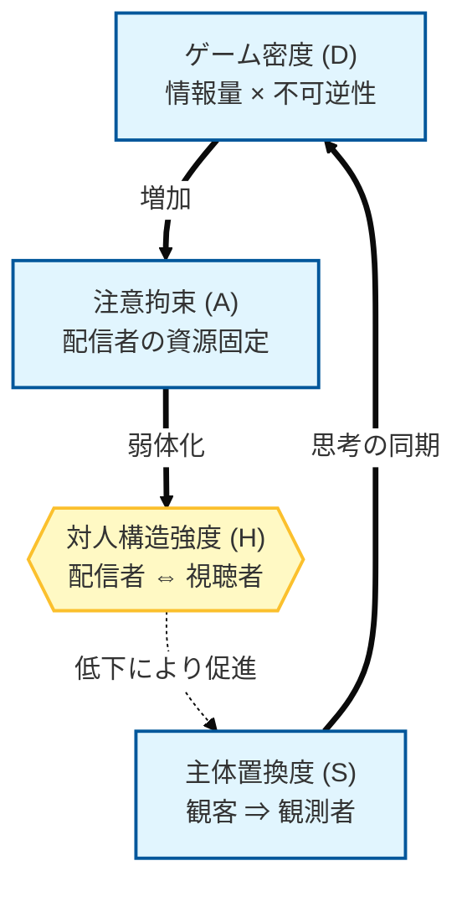
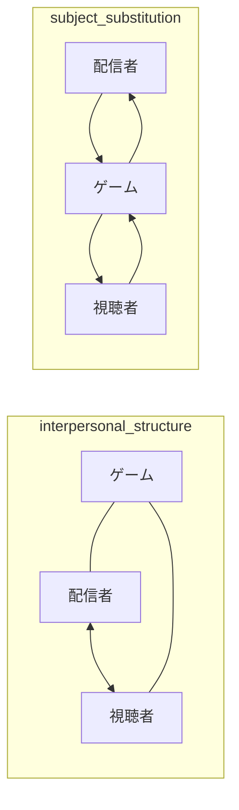
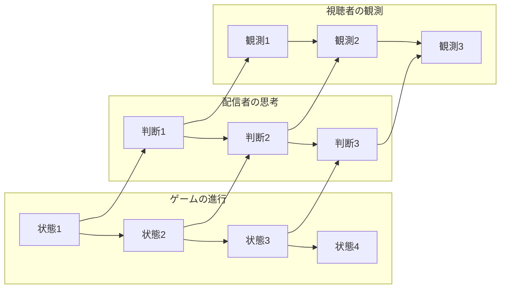

# 構造分析レポート：なぜ「視聴者を無視する配信」が最高の没入を生むのか
 

## このレポートの目的
本レポートは、ゲーム実況における「没入」のメカニズムを、個人の技量や感性といった不確実な要素ではなく、**「ゲーム・配信者・視聴者」の三者が構成する動的な構造**として解明することを目的としています。特に、一般的な良質な配信の条件とされる「視聴者への配慮」が、なぜ没入を阻害し得るのかを四つの構造変数（D/A/H/S）を用いて理論化し、没入が再現可能な「構造的現象」であることを証明します。

ゲーム実況を視聴していると、配信者が視聴者に挨拶をしたり、コメントに反応したり、状況説明を丁寧に行ったりする場面が多く見られる。一般には、こうした対人的なやり取りこそが「良い配信」をつくると考えられている。しかし筆者が強い没入を感じた実況体験を振り返ると、この前提は必ずしも成立しない。むしろ、配信者が視聴者に向き合うほど、筆者の意識はゲームの外側へ押し戻され、没入が途切れる感覚が生じていた。

この没入の差異は、配信者の性格や技量では説明できない。没入は、 **ゲーム（G）・配信者（P）・視聴者（V）**の三者がつくる構造によって生まれる現象である。 本レポートは、この構造を次の四つの変数で説明する。

- **ゲーム密度（D）** ゲームが持つ「情報量」と「不可逆性」の強さ。状態変化が頻繁で巻き戻らないほどDは高い。
    
- **注意拘束（A）** ゲーム密度によって、配信者の注意資源がどれほどゲームに固定されるか。Dが高いほどAは強まる。
    
- **対人構造強度（H）** 配信者と視聴者が互いに向き合う度合い。Aが強まるほどHは弱まる。
    
- **主体置換度（S）** 視聴者が「配信者の外側に立つ観客」から「配信者と同じ方向を向く観測者」へと変化する度合い。Hが弱まるほどSは高まる。
    

これらは独立した要素ではなく、次のような因果連鎖を形成する。

 

**D → A → H（弱体化） → S**

 

すなわち、 ゲーム密度が高いほど配信者の注意はゲームに拘束され、 配信者は視聴者に向き合う余裕を失い、 対人構造が弱まり、 視聴者は配信者の思考の流れに同乗する主体へと置換される。

この因果連鎖が成立するとき、視聴者は配信者の人格ではなく、配信者が直面している状況そのものに意識を向けるようになり、強い没入が生まれる。

この構造は、次の三つの要因として観察できる。

- **対人構造の弱体化（H↓）** 配信者が視聴者に向き合わなくなることで、視聴者はゲーム内部へ入り込みやすくなる。
    
- **ゲーム密度による注意拘束（D→A）** 高密度・不可逆ゲームほど、配信者の注意はゲームに奪われ、雑談が入り込む余地がなくなる。
    
- **主体の置換（S↑）** 視聴者は配信者の外側に立つ観客ではなく、配信者と同じ方向を向く観測者へと変化する。
    

これら三つは互いに強化し合い、没入を自己増幅させる「没入の三角形」を形成する。

- Dが高いほどAが強まり、Hが弱まる
    
- Hが弱まるほどSが進む
    
- Sが進むほど視聴者はゲームの変化を追うようになり、Dの影響がさらに強まる
    

この三角形が回転し始めると、視聴者は配信者の外側に立つ観客ではなく、ゲーム内部に巻き込まれる主体へと変化し、強い没入が成立する。

 

# 第1章　主体の置換としての没入構造：視聴者はどのようにゲーム内部へ入るのか

**【要約】**

- 没入の本質は、視聴者が配信者の外側に立つ「観客」から、同じ方向を向く「観測者」へと変化する「主体置換（S）」にある。
    
- この置換は、ゲーム密度（D）が配信者の注意を拘束（A）し、視聴者への対人構造（H）を強制的に弱体化させることで発生する。
    
- 没入は配信者の意図的な演出ではなく、特定の変数が連鎖する「構造」によって不可避に導かれる現象である。

 

ゲーム実況における没入は、一般には配信者の個性や視聴者への配慮といった対人的な要素によって生まれると考えられている。しかし筆者が強い没入を感じた実況体験を振り返ると、この前提は成立しない場面が多かった。むしろ、配信者が視聴者に挨拶をしたり、状況説明を行ったり、コメントに反応したりするほど、筆者の意識はゲームの外側へ押し戻され、没入が途切れる感覚が生じていた。

この現象は、配信者の性格や技量では説明できない。没入の核心には、 **ゲーム密度（D）→注意拘束（A）→対人構造強度（H）→主体置換度（S）** という因果連鎖が存在している。

## 没入の構造モデル（D-A-H-S因果連鎖）

本レポートで提唱する、ゲーム（G）・配信者（P）・視聴者（V）の三者がつくる没入構造の動的モデルです。
ゲーム密度（D）を起点とした因果連鎖がフィードバックループ（没入の三角形）を形成し、視聴者を主体置換（S）へと導きます。

 

## 1. 変数の定義：没入を生む四つの構造変数

没入を構造として説明するためには、次の四つの変数を明確に定義する必要がある。

- **ゲーム密度（D）** ゲームが持つ「情報量」と「不可逆性」の強さ。 状態変化が頻繁で、巻き戻しが効かないほどDは高い。
    
- **注意拘束（A）** ゲーム密度によって、配信者の注意資源がどれほどゲームに固定されるか。 Dが高いほどAは強まり、配信者は視聴者に向き合う余裕を失う。
    
- **対人構造強度（H）** 配信者と視聴者が互いに向き合う度合い。 Aが強まるほどHは弱まり、対人的なやり取りは後景へ退く。
    
- **主体置換度（S）** 視聴者が「配信者の外側に立つ観客」から「配信者と同じ方向を向く観測者」へと変化する度合い。 Hが弱まるほどSは高まり、視聴者はゲーム内部へ入り込む。
    

これらの変数は、次のような因果構造を形成する。

 

**D → A → H（弱体化） → S**

 

## 2. 対人構造が前面に出る実況では何が起きているのか

配信者が視聴者に向き合う実況では、対人構造強度（H）が高い状態にある。 視聴者は次のような位置に置かれる。

- 配信者の外側に立つ「観客」
    
- 配信者の言葉・反応・人格を観察する主体
    
- ゲームは会話の背景に退く
    

このとき視聴者は、ゲームの状態変化を追う主体ではなく、配信者との関係性の中に位置づけられるため、主体置換度（S）は上昇しない。結果として、没入は成立しにくい。

## 3. 主体置換が起きる実況では何が起きているのか

筆者が強い没入を感じた実況では、配信者は視聴者に向き合うのではなく、ゲームそのものに意識を集中させていた。 このとき、次の構造が成立していた。

- 配信者の注意はゲーム密度（D）によって拘束される
    
- 視聴者への説明や雑談は入り込む余地がない
    
- 対人構造（H）は自然に弱まる
    
- 視聴者は配信者の思考の流れに同乗する
    
- 視聴者は「配信者を見る」のではなく「ゲームという現象を共に観測する」主体へと変化する
    

この変化こそが、主体置換度（S）が上昇する瞬間である。

視聴者は、配信者の背後からゲームを覗き込むような位置に置かれ、配信者と同じ速度で変化する盤面を追う主体へと変化する。 視聴者は配信者の人格ではなく、配信者が直面している「状況」そのものに意識を向けるようになる。

## 4. 二つの実況構造の比較（図示）

以下は、対人構造が前面に出る実況と、主体置換が生じる実況の構造を比較したものである。

 

上段では、視聴者は配信者と向き合う主体であり、ゲームは背景化している。 下段では、視聴者は配信者と同じ方向を向き、ゲームを共に観測する主体へと置換されている。

## 5. 主体置換は「演出」ではなく「構造」によって生まれる

主体置換は、配信者の演出や意図によって生まれるものではない。 次の因果連鎖が成立したとき、構造的に発生する。

- ゲーム密度（D）が高い
    
- 配信者の注意拘束（A）が強まる
    
- 対人構造（H）が弱まる
    
- 視聴者の主体置換（S）が進む
    

筆者が麻雀実況に強い没入を感じたのは、まさにこの構造が明確に働いていたためである。

 

# 第2章　ゲーム密度の差異が生む構造的分岐：なぜ麻雀実況は没入を生むのか

 

**【要約】**

- ゲーム実況の没入度は、ゲーム自体が持つ「情報量」と「不可逆性」の複合値である「ゲーム密度（D）」に規定される。
    
- 麻雀のような高密度ゲームは、配信者の余白を奪い、対人構造を排して視聴者を思考の同期へと強制的に巻き込む。
    
- 逆に低密度な作業ゲームでは対人構造が維持されるため、視聴者は観客の地位に留まり、構造的分岐が生じる。

 

ゲーム実況における没入の差異は、配信者の振る舞いだけでなく、ゲームそのものが持つ構造的特性によって大きく左右される。ここで鍵となるのが、前章で定義した**ゲーム密度（D）**である。ゲーム密度とは、ゲームが持つ「情報量」と「不可逆性」の強さを統合した変数であり、Dが高いほど配信者の注意拘束（A）は強まり、対人構造（H）は弱まり、主体置換（S）が進む。

筆者が強い没入を感じた麻雀実況と、カジュアル作業ゲームを扱う実況を比較すると、両者の間には明確な構造的分岐が存在していた。以下では、この分岐を**D → A → H → S**という因果連鎖に沿って整理する。

## 1. カジュアル作業ゲーム：低密度（Dが低い）ゆえに対人構造が前面に出る

カジュアル作業ゲームは、次の特徴を持つ。

- 一つ一つの操作がゲーム全体に与える影響が小さい
    
- 状態変化が可逆であり、巻き戻しが可能
    
- 情報更新の頻度が低く、判断の連続性が弱い
    

これらはすべて、ゲーム密度（D）を低下させる要因である。

Dが低いゲームでは、配信者の注意拘束（A）は弱くなる。 その結果、次のような構造が生じる。

- 配信者はゲームから意識を離しやすい
    
- 操作と操作の間に「余白」が生まれる
    
- 雑談や視聴者への説明が自然に入り込む
    
- 対人構造強度（H）が高まり、視聴者は配信者と向き合う主体になる
    
- 主体置換（S）は進まず、視聴者はゲーム内部に入り込まない
    

この構造では、ゲームは会話の背景に退き、視聴者は配信者の外側に立つ観客として位置づけられる。没入は成立しにくい。

## 2. 麻雀実況：高密度（Dが高い）ゆえに視聴者がゲーム内部へ巻き込まれる

麻雀は、ゲーム密度（D）が極めて高いゲームである。 その理由は次の通りである。

- 一つの選択が盤面全体を不可逆に変化させる
    
- 相手の捨て牌から手の内を推測し続ける必要がある
    
- 状態変化が常に発生し、判断の連続性が途切れない
    
- 過去の選択が未来の可能性を制限し続ける
    

これらの特性は、Dを最大限に引き上げる。

Dが高いゲームでは、配信者の注意拘束（A）は強制的に高まる。 その結果、次の構造が成立する。

- 配信者は視聴者に向き合う余裕を失う
    
- 雑談は入り込む余地がなく、あってもゲーム文脈に吸収される
    
- 対人構造強度（H）は自然に弱まる
    
- 視聴者は配信者の思考の流れに同乗する
    
- 主体置換（S）が進み、視聴者はゲーム内部へ入り込む
    

視聴者は、配信者の言葉ではなく、配信者が直面している「状況」そのものに意識を向けるようになる。 これが没入の核心である。

## 3. 二つの実況の構造的違いを因果連鎖で比較する

両者の違いは、次の因果連鎖で明確に整理できる。

### カジュアル作業ゲーム（低密度）

- **Dが低い** → Aが弱い → Hが強い → Sが進まない → 視聴者は観客のまま
    

### 麻雀（高密度）

- **Dが高い** → Aが強い → Hが弱い → Sが進む → 視聴者は観測者へと置換される
    

この構造的分岐こそが、没入の差異を生み出している。

## 4. 視聴者の注意の向きが変わる瞬間

麻雀実況では、視聴者は次のような変化を経験する。

- 配信者の言葉を聞くのではなく、配信者の判断の根拠を追う
    
- 配信者の人格を見るのではなく、盤面の変化を追う
    
- 配信者の外側に立つ観客ではなく、配信者と同じ方向を向く観測者になる
    

この変化は、配信者の演出ではなく、ゲーム密度（D）が高いことによって生じる構造的必然である。

## 5. 結論：没入はゲーム密度によって規定される

筆者が麻雀実況に強い没入を感じたのは、偶然ではない。 麻雀が持つ高密度・不可逆性が、配信者の注意拘束（A）を強め、対人構造（H）を弱め、主体置換（S）を進める構造を内包していたためである。

没入は、配信者の技量や視聴者の感性ではなく、 **ゲーム密度（D）→注意拘束（A）→対人構造（H）→主体置換（S）** という構造によって規定される。

 

# 第3章　不可逆な情報更新が配信者のノイズを消す理由：思考の流れが視聴者を巻き込む構造

 

**【要約】**

- 状態変化が巻き戻らない「不可逆性」は、ゲーム密度を最大化し、配信者の発話を「説明」から「思考の断片」へと変質させる。
    
- 配信者の人間的なノイズが削ぎ落とされることで、ゲーム・配信者・視聴者の三層が「情報の流れ」において完全同期する。
    
- この同期構造こそが、視聴者を配信者の背後からゲーム内部へと引きずり込む「没入のエンジン」として機能する。

 

麻雀実況における没入の核心には、ゲームが持つ**不可逆な情報更新**という構造がある。 不可逆性とは、一度起きた状態変化が巻き戻らず、未来の可能性を恒常的に制限し続ける性質である。 この不可逆性こそが、ゲーム密度（D）を決定する最重要要素であり、配信者の注意拘束（A）を強制的に高め、対人構造（H）を弱め、主体置換（S）を進める。

本章では、不可逆な情報更新がどのように配信者の「人間的ノイズ」を構造的に消し、視聴者をゲーム内部へ巻き込むのかを、D → A → H → S の因果連鎖に沿って明らかにする。

## 1. 不可逆性がゲーム密度（D）を最大化する

麻雀のような不可逆ゲームでは、次の特徴が成立する。

- 一度捨てた牌は二度と戻らない
    
- 相手の行動は巻き戻せず、常に未来の可能性を削り続ける
    
- 状態変化が連続し、判断の余白がほとんど存在しない
    
- 過去の選択が未来の選択肢を恒常的に制限する
    

これらはすべて、ゲーム密度（D）を最大限に引き上げる要因である。

Dが高いゲームでは、配信者は「次の判断を誤れば即座に不利になる」という構造に置かれるため、注意資源をほぼすべてゲームに割かざるを得ない。

## 2. 注意拘束（A）が配信者の言語を「思考の断片」に変える

ゲーム密度（D）が高まると、配信者の注意拘束（A）は強制的に高まる。 Aが強い状態では、配信者の言葉は次のように変質する。

- 視聴者への説明ではなく、思考の延長として発話される
    
- 雑談は入り込む余地がなく、ゲーム文脈に吸収される
    
- 感情表現よりも判断の根拠が優先される
    
- 言葉が「状況への反応」として機能する
    

このとき、配信者の言語は「視聴者に向けたコミュニケーション」ではなく、「思考の断片」として現れる。

視聴者は、配信者の人格ではなく、配信者の思考の軌跡を追う主体へと変化する。

## 3. 対人構造（H）が弱まり、視聴者は観客から観測者へと移動する

注意拘束（A）が強まると、配信者は視聴者に向き合う余裕を失う。 その結果、対人構造強度（H）は自然に弱まる。

Hが弱まると、視聴者は次のような位置に置かれる。

- 配信者の外側に立つ観客ではなく
    
- 配信者と同じ方向を向く観測者
    
- 配信者の思考の流れに同乗する主体
    
- ゲームの状態変化を自ら追う主体
    

視聴者は、配信者の「人間的ノイズ」ではなく、配信者が直面している「状況」そのものに意識を向けるようになる。

## 4. 主体置換（S）が進む三層構造：ゲーム → 配信者 → 視聴者

不可逆な情報更新が続くゲームでは、次の三層構造が成立する。

 

この構造では、

- 配信者の判断はゲームの状態に依存し
    
- 視聴者の観測は配信者の判断に依存する
    

という三層の同期が成立する。

視聴者は、配信者の外側に立つ観客ではなく、配信者と同じ情報の流れに巻き込まれる主体へと変化する。 これが主体置換（S）が進む瞬間である。

## 5. 可逆ゲームではなぜこの構造が成立しないのか

カジュアル作業ゲームのような可逆ゲームでは、次の特徴がある。

- 状態変化が巻き戻せる
    
- 判断の連続性が弱い
    
- 情報更新が断続的である
    
- 配信者がゲームから意識を離しやすい
    

これらはゲーム密度（D）を低下させ、注意拘束（A）を弱め、対人構造（H）を強める。 その結果、主体置換（S）は進まず、視聴者はゲーム内部に入り込まない。

## 6. 結論：不可逆性は没入を生む「構造的エンジン」である

筆者が麻雀実況に強い没入を感じたのは、配信者が視聴者を無視したからではない。 ゲームが持つ不可逆性が、次の因果連鎖を強制的に発動させていたためである。

- **不可逆性 → ゲーム密度（D）の上昇**
    
- **Dの上昇 → 注意拘束（A）の強化**
    
- **Aの強化 → 対人構造（H）の弱体化**
    
- **Hの弱体化 → 主体置換（S）の進行**
    

没入は、配信者の演出ではなく、ゲームが持つ構造によって自然に形成される。

 

# 第4章　結論：没入は感性ではなく構造で説明できる

 

**【要約】**

- 没入体験は、D→A→H→Sの因果連鎖がループとして回転し、自己増幅することで成立する再現性の高い現象である。
    
- 従来「好み」や「相性」で片付けられていた事象を四変数で分析することで、没入の発生を論理的に予測・評価することが可能になる。
    
- 結論として、没入とは「配信者との関係」に入ることではなく、配信者と共に「同じ情報の系」に巻き込まれる体験を指す。

 

本レポートを通じて明らかになったのは、ゲーム実況における没入体験が、配信者の個性や視聴者への配慮といった表層的な要素によって決まるのではなく、**ゲーム（G）・配信者（P）・視聴者（V）**の三者が形成する構造によって規定されているという事実である。

没入の核心には、次の四つの変数が存在する。

- **ゲーム密度（D）** 情報量と不可逆性の強さ。Dが高いほど配信者の判断負荷は増す。
    
- **注意拘束（A）** Dによって配信者の注意資源がどれほどゲームに固定されるか。Dが高いほどAは強まる。
    
- **対人構造強度（H）** 配信者と視聴者が互いに向き合う度合い。Aが強まるほどHは弱まる。
    
- **主体置換度（S）** 視聴者が「観客」から「観測者」へと変化する度合い。Hが弱まるほどSは進む。
    

これらは独立した要素ではなく、次の因果連鎖を形成する。

 

**D → A → H（弱体化） → S**

 

この連鎖が成立するとき、視聴者は配信者の人格ではなく、配信者が直面している状況そのものに意識を向けるようになり、強い没入が生まれる。

## 1. 没入は「配信者が視聴者を無視したから」生まれるのではない

筆者が麻雀実況に強い没入を感じたのは、配信者が視聴者を軽視したからではない。 むしろ、次の構造が自然に働いていたためである。

- 麻雀というゲームが高い不可逆性を持ち
    
- その不可逆性がゲーム密度（D）を引き上げ
    
- Dが配信者の注意拘束（A）を強制し
    
- Aが対人構造（H）を弱め
    
- Hの弱体化が主体置換（S）を進めた
    

没入は、配信者の意図や演出ではなく、ゲームが持つ構造によって自動的に形成される。

## 2. カジュアル作業ゲームで没入が生まれにくい理由も構造で説明できる

カジュアル作業ゲームでは、次の構造が働く。

- 状態変化が可逆であり
    
- 情報更新が断続的で
    
- 判断の連続性が弱く
    
- ゲーム密度（D）が低い
    

その結果、

- 注意拘束（A）が弱まり
    
- 対人構造（H）が強まり
    
- 主体置換（S）が進まず
    
- 視聴者はゲーム内部に入り込まない
    

没入が生まれにくいのは、視聴者の感性ではなく、ゲーム構造がそうなるように働いているためである。

## 3. 没入は「感性」ではなく「構造」で再現できる

没入はしばしば「好み」「相性」「感性」といった主観的な言葉で語られるが、本レポートが示したように、没入は次の四変数の組み合わせで説明できる。

- **D（ゲーム密度）**
    
- **A（注意拘束）**
    
- **H（対人構造強度）**
    
- **S（主体置換度）**
    

これらの変数がどのように作用しているかを観察すれば、視聴者がなぜ没入したのか、あるいは没入しなかったのかを構造的に説明できる。

没入は「偶然の体験」ではなく、 **構造が生み出す再現可能な現象**である。

## 4. 構造を理解することで、視聴体験は分析可能な対象へと変わる

構造を理解すると、視聴体験は次のように変化する。

- 「なぜこの実況は面白いのか」を説明できる
    
- 「なぜこの実況は退屈なのか」を説明できる
    
- 「どのゲームが没入を生みやすいか」を予測できる
    
- 「どの瞬間に主体置換が起きたか」を観察できる
    

視聴体験は、感覚的な印象ではなく、構造的な分析対象へと変わる。

## 5. 結論：没入とは、配信者と視聴者が同じ系に巻き込まれる現象である

没入とは、配信者との関係性に入り込むことではない。 視聴者が配信者と同じ方向を向き、同じ情報の流れを共有し、同じ制約の中で思考を進める主体へと置換されることで成立する。

その変化を生み出すのは、 **ゲーム密度（D）→注意拘束（A）→対人構造（H）→主体置換（S）** という構造である。

没入は感性ではなく構造で説明できる。 そして構造を理解したとき、視聴体験は再現性を持った知識へと変換される。

 

# 補論A、B

 

**【要約】**

- 低密度ゲームでも「時間制限」等の外部圧力が加われば、一時的に密度（D）が上昇し、構造的に没入が誘発される。
    
- スポーツ観戦との比較を通じ、ゲーム実況特有の「言語による思考の可視化」が主体置換をより深化させる要因であることを特定する。
    
- 構造的視点を持つことで、あらゆる視聴体験を感覚的な印象から「分析可能な知識」へと変換できる。

 

## 補論A　低密度・可逆ゲームでも没入が生まれる例外構造

本レポートでは、没入が **D（ゲーム密度）→A（注意拘束）→H（対人構造）→S（主体置換）** という因果連鎖によって生まれることを示してきた。

しかし、低密度・可逆ゲームであっても、特定の条件下では強い没入が生まれることがある。 これは「例外」ではなく、**ゲーム密度（D）が一時的に上昇する構造**が働くためである。

## 1. 低密度ゲームでもDが上昇する三つの条件

低密度ゲームでも、次の条件が加わるとDが急激に上昇する。

### （1）制限時間の導入

- 時間制約が不可逆性を生む
    
- 判断の余白が消え、連続的な思考が必要になる
    
- Dが一時的に高まる
    

### （2）協力プレイ・対戦プレイ

- 他者の行動が不可逆な外部変数として作用する
    
- 状態変化が予測不能になり、情報密度が上昇する
    
- Dが高まり、Aが強まる
    

### （3）外部からの圧力（イベント・敵の襲来・ランダム要素）

- ゲームがプレイヤーに判断を強制する
    
- 可逆ゲームでも「不可逆な瞬間」が生まれる
    
- Dが局所的に上昇する
    

これらの条件が揃うと、低密度ゲームでも次の連鎖が発動する。

**D↑ → A↑ → H↓ → S↑**

結果として、視聴者はゲーム内部へ巻き込まれ、没入が成立する。

## 2. 例外は「構造の破れ」ではなく「密度の変動」で説明できる

重要なのは、これらの例外が「低密度ゲームでも没入が起きる」という不規則な現象ではなく、 **ゲーム密度（D）が一時的に上昇することで説明できる構造的現象**だという点である。

没入は、ゲームジャンルではなく、 **その瞬間のDがどれほど高いか** によって決まる。

 

## 補論B　スポーツ観戦とゲーム実況の共通点と相違点

スポーツ観戦は、世界中で普遍的に楽しまれている娯楽であり、強い没入を生む。 この没入は、ゲーム実況と同じく、**不可逆な状態変化を持つ系**に観客が巻き込まれることで成立する。

しかし、スポーツとゲーム実況には、没入構造が共通する一方で、決定的な相違点も存在する。

## 1. 共通点：どちらも「不可逆な系」を観測する構造で没入が生まれる

スポーツ観戦もゲーム実況も、次の構造を共有している。

- 状態変化が不可逆である（プレーは巻き戻らない）
    
- 観客は選手（または配信者）と同じ方向を向く
    
- 状況の変化をリアルタイムで追う
    
- 判断の根拠を推測しながら観測する
    
- 観客同士の対話がなくても一体感が生まれる
    

これは、 **D（密度）→A（注意拘束）→H（対人構造の弱体化）→S（主体置換）** という構造がスポーツにも働いているためである。

## 2. 相違点①：観客は選手の身体性を共有していない

スポーツでは、観客は選手の身体性を共有していない。 そのため、観客は選手の「思考の窓」を直接見ることができず、 判断の根拠を推測する必要がある。

ゲーム実況では、配信者の声が「思考の窓」として機能するため、 視聴者は配信者の思考の流れにより深く同調できる。

この違いは、ゲーム実況の没入がスポーツよりも **思考の同期（Sの上昇）** に強く依存していることを示している。

## 3. 相違点②：ゲーム実況では「言語」が主体置換を補助する

スポーツでは、選手の判断は言語化されない。 一方でゲーム実況では、配信者の発話が次の役割を果たす。

- 判断の根拠を言語化する
    
- 状況の変化を言語で補足する
    
- 思考の断片を視聴者に共有する
    

これにより、視聴者は配信者の思考の流れに同乗しやすくなり、 主体置換（S）がより強く進む。

## 4. 結論：スポーツとゲーム実況は「同じ構造」で没入を生み、「異なる要素」で強度が変わる

両者は、 **不可逆な系を観測する構造** という共通点を持つ。

しかし、

- 身体性の非共有
    
- 言語による思考の可視化 という相違点が、没入の強度や質に差を生む。
    

ゲーム実況の没入は、スポーツ観戦と同じ構造を持ちながら、 **思考の同期という追加要素によって、より強く・より深く成立する**。

 

# 第5章　観察軸：読者が自分の視聴体験を分析するために

 

**【要約】**

- 読者が自らの体験を分析するための指標として、「配信者の注意先（A）」「ゲームの不可逆性（D）」「自分の位置（S）」の三軸を提示する。
    
- 配信者の言葉が「説明」か「独り言」かを見極めることで、その場の対人構造（H）の強度を客観的に測定できる。
    
- これらの観察軸は、漠然とした「面白い」の正体を分解し、視聴体験をメタ認知するための実践的なツールとなる。

 

ここまで、没入が **D（ゲーム密度）→A（注意拘束）→H（対人構造の弱体化）→S（主体置換）** という因果連鎖によって生まれることを示してきた。

しかし、この構造は理論として理解するだけでは不十分である。 読者が自分の視聴体験に適用し、 「なぜこの実況は没入できたのか」 「なぜこの実況は退屈だったのか」 を自ら分析できるようになって初めて、構造分析は実践的な価値を持つ。

本章では、読者が自分の視聴体験を分析するための**三つの観察軸**を提示する。 これらは、没入の四変数（D・A・H・S）を直接観察可能な形に変換したものである。

## 1. 観察軸①：配信者の注意はどこに向いているか（Aの観察）

没入の第一段階は、配信者の注意拘束（A）がどれほど強いかを見極めることである。 Aは直接見えないが、次のような兆候から観察できる。

- 配信者がゲームの状況に対して即時に反応しているか
    
- 判断の根拠を言語化する余裕があるか
    
- 雑談が自然に入り込むか、それとも入り込む余地がないか
    
- 視聴者への説明が「意識的」か「思考の断片」か
    

Aが強い実況では、配信者の言葉は説明ではなく「思考の延長」として現れる。 Aが弱い実況では、配信者はゲームから意識を離し、視聴者との対話が中心になる。

## 2. 観察軸②：ゲームの状態変化はどれだけ不可逆か（Dの観察）

ゲーム密度（D）は、没入の根本原因である。 Dは次のような観点から観察できる。

- 一つの選択が未来の可能性をどれほど制限するか
    
- 状態変化が巻き戻せるかどうか
    
- 判断の連続性がどれほど強いか
    
- 情報更新が断続的か、連続的か
    
- 他プレイヤーの行動が不可逆な外部変数として作用するか
    

Dが高いゲームでは、配信者は判断を連続的に求められ、注意拘束（A）が強まる。 Dが低いゲームでは、操作と操作の間に「余白」が生まれ、雑談が入り込みやすくなる。

## 3. 観察軸③：視聴者はどの位置に置かれているか（HとSの観察）

視聴者がどの位置に置かれているかは、 **対人構造（H）と主体置換（S）の複合的な観察**によって判断できる。

次のような点に注目するとよい。

- 視聴者は配信者と向き合っているか、それとも配信者と同じ方向を向いているか
    
- 配信者の言葉を「説明」として聞いているか、「思考の断片」として受け取っているか
    
- ゲームの状態変化を自分の問題として追っているか
    
- 配信者の人格を見ているのか、配信者が直面している状況を見ているのか
    
- コメント欄が「対話の場」になっているか、「観測の共有」になっているか
    

視聴者が配信者と向き合っている場合、Hは強く、Sは進まない。 視聴者が配信者と同じ方向を向いている場合、Hは弱く、Sが進む。

## 4. 三つの観察軸を統合すると、没入の構造が見えてくる

三つの観察軸は、次のように統合される。

- **配信者の注意がゲームに固定されているか（A）**
    
- **ゲームの状態変化が不可逆で高密度か（D）**
    
- **視聴者がどの位置に置かれているか（H・S）**
    

これらを同時に観察すると、視聴者は次のように判断できる。

- なぜこの実況は没入できたのか
    
- なぜこの実況は退屈だったのか
    
- どの瞬間に主体置換（S）が起きたのか
    
- どの変数が没入を阻害していたのか
    
- どのゲームが没入を生みやすい構造を持っているのか
    

視聴体験は、感覚的な印象ではなく、構造的に分析可能な対象へと変わる。

## 5. 結論：観察軸を持つことで、視聴体験は「再現可能な知識」へと変わる

没入は偶然の産物ではない。 視聴者がどの位置に置かれ、配信者がどこに注意を向け、ゲームがどれほど不可逆か── これらの構造が組み合わさった結果として生まれる。

観察軸を持つことで、読者は次のことが可能になる。

- 自分の視聴体験を構造的に説明できる
    
- 他者の視聴体験を比較できる
    
- 没入を生む実況の条件を予測できる
    
- ゲームの構造を分析し、没入の発生確率を推定できる
    

構造を理解することは、視聴体験を「再現可能な知識」へと変換する行為である。 これこそが、本レポートが目指す最終的な価値である。

 

# 結論：没入は感性ではなく構造で説明できる

本レポートが示してきたのは、ゲーム実況における没入が、配信者の個性や視聴者の感性といった主観的な要素によって生まれるのではなく、**ゲーム（G）・配信者（P）・視聴者（V）**の三者が形成する構造によって規定されているという事実である。

没入の核心には、次の四つの変数が存在する。

- **ゲーム密度（D）** 情報量と不可逆性の強さ。Dが高いほど、配信者は判断を連続的に求められる。
    
- **注意拘束（A）** Dによって配信者の注意資源がどれほどゲームに固定されるか。Dが高いほどAは強まる。
    
- **対人構造強度（H）** 配信者と視聴者が互いに向き合う度合い。Aが強まるほどHは弱まり、対人的なやり取りは後景へ退く。
    
- **主体置換度（S）** 視聴者が「観客」から「観測者」へと変化する度合い。Hが弱まるほどSは進む。
    

これらは独立した要素ではなく、次の因果連鎖を形成する。

**D → A → H（弱体化） → S**

この連鎖が成立するとき、視聴者は配信者の人格ではなく、配信者が直面している状況そのものに意識を向けるようになり、強い没入が生まれる。

## 1. 没入は「配信者が視聴者を無視したから」生まれるのではない

筆者が麻雀実況に強い没入を感じたのは、配信者が視聴者を軽視したからではない。 むしろ、麻雀というゲームが持つ**不可逆性と高密度**が、次の構造を自然に発動させていたためである。

- Dが高い
    
- → Aが強まる
    
- → Hが弱まる
    
- → Sが進む
    

没入は、配信者の意図や演出ではなく、ゲームが持つ構造によって自動的に形成される。

## 2. カジュアル作業ゲームで没入が生まれにくい理由も構造で説明できる

カジュアル作業ゲームでは、状態変化が可逆であり、情報更新が断続的で、判断の連続性が弱い。 そのため、ゲーム密度（D）は低く、注意拘束（A）は弱まり、対人構造（H）は強まり、主体置換（S）は進まない。

没入が生まれにくいのは、視聴者の感性ではなく、ゲーム構造がそうなるように働いているためである。

## 3. 例外も「構造」で説明できる

低密度ゲームでも、制限時間・協力プレイ・外部圧力などによって**一時的にDが上昇**すると、 同じ連鎖（D→A→H→S）が発動し、没入が生まれる。

例外は「特殊なケース」ではなく、密度の変動によって説明できる構造的現象である。

## 4. スポーツ観戦も同じ構造で没入を生む

スポーツ観戦も、不可逆な状態変化を持つ系を観測するという点で、ゲーム実況と同じ構造を持つ。 ただし、ゲーム実況では配信者の声が「思考の窓」として機能するため、 視聴者はより深く主体置換（S）を経験しやすい。

没入は領域を超えて一貫した構造で説明できる。

## 5. 構造を理解すると、視聴体験は「再現可能な知識」へと変わる

構造を理解することで、視聴者は次のことが可能になる。

- なぜ没入したのかを説明できる
    
- なぜ没入しなかったのかを説明できる
    
- どの瞬間に主体置換（S）が起きたかを観察できる
    
- どのゲームが没入を生みやすいかを予測できる
    

視聴体験は、感覚的な印象ではなく、構造的に分析可能な対象へと変わる。

## 6. 結論：没入とは、構造が回転することで生まれる現象である

没入とは、 **ゲーム密度（D）→注意拘束（A）→対人構造（H）→主体置換（S）** という四つの変数が互いに強化し合い、ループとして回転することで生まれる。

視聴者は配信者との関係性に入り込むのではなく、 配信者と同じ方向を向き、同じ情報の流れを共有し、 同じ制約の中で思考を進める主体へと変化する。

没入は感性ではなく構造で説明できる。 そして構造を理解したとき、視聴体験は再現性を持った知識へと変換される。
