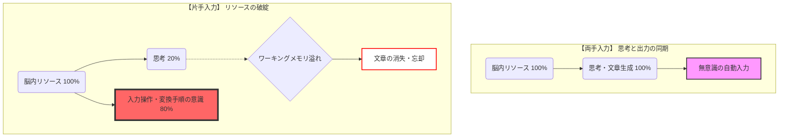
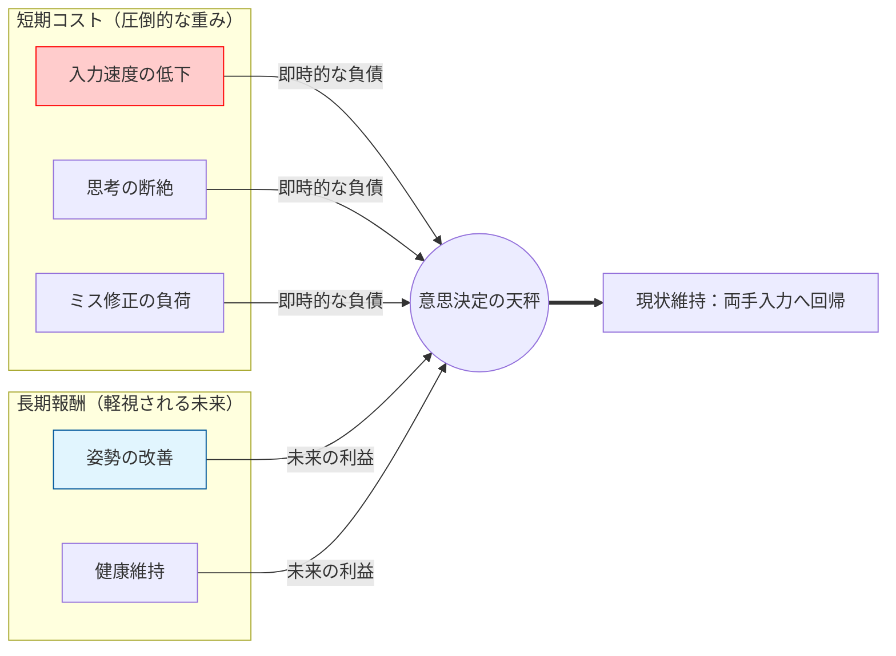

# 構造分析レポート：身体操作の再定義における「報酬とコスト」の不整合

長時間のタイピングを前提とする知的労働において、入力デバイスの選択は単なる道具の問題ではなく、身体と認知の双方に影響を及ぼす構造的な課題である。私はこれまで、分割キーボードの導入によって肩の内巻きを抑え、より自然な姿勢で作業を行うという理想を描いてきた。しかし、価格や環境の制約からすぐに導入することは難しく、代替案として「左手のみでキーボード入力を行い、右手はマウス操作に専念させる」という構造を PowerToys によって試みた。ところが、この方式は実務の場面ではほとんど定着せず、私は意図的に PowerToys を起動時に無効化し、従来の両手入力へと戻ってしまう。

この現象は、単なる「慣れの問題」や「意志の弱さ」といった表層的な説明では捉えきれない。むしろ、両手入力が長年の経験によって高度に自動化され、思考と出力がほぼ同時に進行する「身体化された認知構造」として成立していることこそが、片手入力への移行を阻む本質的な要因である。片手入力を試みると、私は一文字を打つたびに変換手順を意識し、入力ミスの修正に思考を割かれ、頭の中で形成されつつあった文章が次々と消えていく。これは、思考と入力の同期が崩壊し、脳内リソースの配分が逆転することで生じる構造的な破綻である。

本レポートでは、この「片手入力が実務で定着しない理由」を、身体操作・認知負荷・報酬構造・動作文脈といった複数の層から分析し、なぜ合理的なはずの新しい入力方式が、最終的には脳によって拒絶されるのかを明らかにする。さらに、部分的ショートカット導入が機能しなかった理由や、健康上のメリットが即時的な生産性低下を上回らなかった背景を検討し、最終的に「道具の置換」ではなく「動作の再構成」という別のアプローチが必要であることを示す。

# **第1章　問題の発端：身体的理想と現実の乖離**

長時間のタイピングを前提とする作業において、姿勢の崩れや肩の内巻きは避けがたい問題である。私も例外ではなく、日々の入力作業の積み重ねによって身体への負担を自覚するようになった。そこで興味を持ったのが、左右に分割されたキーボードである。肩を自然に開いた姿勢で入力できるという構造は、身体的な負荷を軽減する理想的な解決策に思えた。しかし、分割キーボードは価格が高く、すぐに導入することは難しかった。

この制約の中で、私は代替案として「左手のみでキーボード入力を行い、右手はマウス操作に専念させる」という構造を考えた。PowerToys を用いてキー配置を変更し、左手だけで文字入力が完結するように設定すれば、右手をマウスに固定したまま作業ができる。これにより、肩を開いた姿勢を維持しながら入力作業を行えるのではないかと考えたのである。

しかし、この構造は実務の場面ではほとんど機能しなかった。私はパソコン起動時に PowerToys が自動で立ち上がらないよう設定し、必要なときだけ手動で起動するようにしていた。これは、片手入力が実務において生産性を著しく低下させることを自覚していたためである。実際、メールチェックや返信といった日常的な作業では、私は自然と両手入力に戻ってしまい、片手入力を使う機会はほとんど生まれなかった。

この現象は、単に「慣れていないから使わなかった」という表面的な理由では説明できない。むしろ、両手入力が長年の経験によって高度に自動化され、思考と入力が密接に結びついた構造として成立していることが、片手入力の導入を阻む本質的な要因である。身体的な理想を追求しようとしたにもかかわらず、現実の作業環境ではその理想が受け入れられなかった。この「身体的理想と現実の乖離」こそが、本問題の出発点である。

次章では、この乖離がどのようにして「思考と入力の同期崩壊」という具体的な現象として現れたのかを検討する。

# **第2章　現象の定義：思考と入力の同期崩壊**

片手入力を導入した際、最初に直面したのは「思考と入力の同期が崩れる」という現象であった。両手入力では、私は文章を考えると同時に指が自動的に動き、入力という行為を意識することはほとんどない。思考と出力が一体化し、文章生成のプロセスが滑らかに進行する。この状態では、入力は思考の延長として機能し、私は文章の内容そのものに集中できていた。

しかし片手入力に切り替えた瞬間、この構造は完全に崩れた。私は一文字を入力するたびに、どのキーを押すべきかを意識しなければならず、入力という行為が思考の前面に押し出される。例えば「か」を入力するために Shift+D を押し、その後に A を押すという手順を考える必要がある。このような変換処理は、両手入力では決して意識することのなかった負荷であり、思考の流れを細かく分断する原因となった。

さらに、慣れない操作であるため入力ミスが増え、修正のためにバックスペースを押し、再度同じ手順を考え直すという工程が加わる。これにより、文章生成のプロセスは断続的になり、頭の中で形成されつつあった文章が次々と消えていく。私は文章を「考える」ことよりも、「入力するための手順を思い出す」ことに多くのリソースを割かざるを得なくなり、思考の保持が困難になった。

この現象は、脳内リソースの配分が大きく変化した結果として生じている。両手入力では、思考にほぼ全てのリソースを割き、入力は無意識の自動処理として行われていた。しかし片手入力では、入力操作そのものに多くのリソースが必要となり、思考に割ける余力が大幅に減少する。私の感覚では、思考に割けるリソースは二割程度にまで低下し、残りの八割が入力操作に奪われていた。

この「思考と入力の同期崩壊」は、単なる不便さではなく、文章生成の根本的な構造が破壊されることを意味する。思考の速度に入力が追いつかず、ワーキングメモリに保持されていた内容が消失し、文章の一貫性が損なわれる。結果として、私は片手入力を使うたびに生産性が著しく低下し、実務の場面では自然と両手入力へと戻ってしまった。

本章で明らかになったように、片手入力は思考と入力の同期を崩壊させ、脳内リソースの配分を逆転させる構造的な問題を引き起こす。次章では、この問題がなぜ「熟練者特有の罠」として現れるのか、既存スキルが新習慣を拒絶する構造について検討する。

# **第3章　熟練者の罠：既存スキルが新習慣を拒絶する構造**

片手入力が実務で定着しなかった理由を考えるとき、私は当初「慣れていないから使えない」「練習不足」といった単純な説明を思い浮かべていた。しかし、両手入力が長年の経験によって高度に自動化されているという事実を踏まえると、この現象はより深い構造的要因によって生じていることが明らかになる。すなわち、**熟練者であるほど新しい入力方式への移行が困難になる**という逆説的な構造である。

両手入力は、思考と出力がほぼ同時に進行する「高速道路」のようなものである。私は文章を考えると同時に指が動き、入力という行為を意識することはほとんどない。この高速道路は、長年の反復によって形成された強固な回路であり、知的生産における効率性を最大化するために最適化されている。私はこの高速道路を使うことで、複雑な内容を扱う際にも思考の連続性を保ち、短時間で正確な文章を生成することができていた。

しかし、新しい入力方式を導入するということは、この高速道路を一時的に封鎖し、未舗装の脇道を通ることを意味する。片手入力は、キーの位置や変換手順を意識しながら進む必要があり、速度も安定性も両手入力には遠く及ばない。この「未舗装の脇道」を通ることは、熟練者にとって極めて大きなストレスとなる。なぜなら、熟練者はすでに高速道路の利便性を知っており、脇道を通ることによって生じる生産性の低下を強く意識してしまうからである。

さらに、熟練者は既存のスキルが強固に身体化されているため、新しい操作を導入する際に「古い回路」と「新しい回路」が競合する。両手入力の回路は長年の経験によって強化されており、片手入力の回路はまだ形成途上である。この不均衡な競合は、脳が自動的に「より効率的な回路」を選択するという性質によって、片手入力の回路が常に押し負けるという結果を生む。実務の場面では特に、脳は「失敗しないこと」「速度を落とさないこと」を最優先するため、片手入力を選択する余地はほとんど残されていない。

この構造は、未習得者との対比によってさらに明確になる。未習得者はもともとキーを探しながら入力するため、新しい方式への移行コストが比較的低い。彼らにとっては、どの方式を使っても一定の意識的負荷がかかるため、片手入力への移行は「別の不便さに置き換わる」程度の変化に過ぎない。しかし熟練者にとっては、既存の高速道路を捨てて未舗装路を進むことは、知的生産性を大幅に損なう重大なリスクを伴う。このリスクを脳が合理的に回避しようとすることは、むしろ自然な反応である。

このように、熟練者ほど新しい入力方式への移行が困難になるのは、既存のスキルが高度に自動化されていることによって生じる構造的な問題である。片手入力が実務で定着しなかったのは、私の意志が弱かったからではなく、脳が「生産性の維持」という合理的な判断を下した結果である。この構造を理解することで、私はようやく自分の行動を責めるのではなく、現実的な移行戦略を考えるための土台を得ることができた。

次章では、この構造的な困難を踏まえたうえで、部分的導入がなぜ機能しなかったのか、そして「動作の文脈」がどのように影響したのかを検討する。

# **第4章　部分導入の失敗：動作の文脈（コンテキスト）不一致**

片手入力の導入が困難であったことを受け、私はより現実的な方法として「部分的なショートカット導入」を試みた。無変換キーを Enter に、Caps Lock を Backspace に割り当てるなど、左手だけで完結する操作をいくつか設定し、両手入力を維持しながら左手の負担を軽減する構造を模索した。しかし、これらのショートカットはほとんど使用されず、実務において定着することはなかった。

この失敗は、設定が不適切だったという単純な理由では説明できない。むしろ、**動作の文脈（コンテキスト）と機能の文脈が一致していなかった**ことが、ショートカットが自然な行動として呼び出されなかった本質的な要因である。

私は右手でマウスを操作しているとき、脳が「ナビゲーションモード」に入っている。画面の移動、クリック、スクロールといった操作が中心となり、文章入力の文脈とは異なる認知状態にある。この状態で、左手に「タイピング系の操作」である Enter や Backspace を割り当てても、脳はそれを自然な動作として認識しない。右手がマウスを握っている瞬間、左手は「補助的なナビゲーション操作」を担当するべきであり、「文章入力の一部」を担うことは脳のモードと一致しない。

さらに、私が割り当てたショートカットは、普段の作業で頻繁に使用する操作ではなかった。Enter や Backspace は確かに使用頻度が高いが、それはあくまで文章入力の文脈においてであり、マウス操作中に必要とされる動作ではない。結果として、ショートカットは「存在しているが使われない機能」として埋もれ、習慣として定着することはなかった。

この経験は、部分導入が失敗した理由を明確に示している。すなわち、**新しい操作を導入する際には、動作の文脈と機能の文脈が一致していなければならない**ということである。脳は常に「今どのモードで作業しているか」を判断し、そのモードに適した動作だけを自然に呼び出す。モードと一致しない操作は、どれほど便利に見えても、実務の中で使われることはない。

この構造を理解すると、片手入力の部分導入が失敗したのは必然であったと言える。私は「文字入力の一部」を左手に移そうとしたが、脳がその動作を呼び出す文脈にいなかったため、ショートカットは機能しなかった。これは、単なる設定の問題ではなく、**動作の文脈に基づかない機能配置が脳にとって不自然である**という構造的な問題である。

次章では、この「文脈の不一致」に加えて、片手入力が持つもう一つの大きな壁――**報酬構造の不整合**について検討する。なぜ脳は片手入力を合理的に拒絶したのか。その背景にある「短期報酬」と「長期報酬」の対立を明らかにする。

# **第5章　報酬構造の不整合：なぜ脳は片手入力を拒絶するのか**

片手入力が実務で定着しなかった理由を検討するうえで、動作の文脈だけでは説明しきれない要素が存在する。それが、**報酬構造の不整合**である。私は片手入力を導入することで、肩を開いた姿勢を維持し、身体的な負担を軽減するという長期的な利益を期待していた。しかし、実際の作業環境では、この長期的な利益は、入力速度の低下や思考の断絶といった短期的な不利益を上回ることができなかった。

脳は常に「今この瞬間の生産性」を最優先する。特に実務の場面では、文章を素早く正確に入力することが求められ、入力方式の変更によって生じる遅延やミスは、直接的なストレスとして認識される。片手入力を使用すると、私は一文字を入力するたびに変換手順を意識し、入力ミスを修正し、思考の断片が消えていくのを感じた。これらの負荷は、身体的な姿勢改善という長期的な利益よりも、はるかに強く、即時的に脳へ影響を与えた。

この構造は、報酬の時間軸によって説明できる。 身体的な姿勢改善は「長期報酬」であり、効果が現れるまでに時間がかかる。一方、入力速度の低下や思考の断絶は「短期コスト」であり、その影響は即座に現れる。脳は短期コストを強く評価し、長期報酬を過小評価する傾向があるため、片手入力は合理的に拒絶される。これは、健康のために運動を始めようとしても、目の前の疲労感に負けて続かないという現象と同じ構造である。

さらに、片手入力は「成功体験」を得にくいという問題も抱えている。両手入力では、思考と入力が同期し、文章が滑らかに生成されるという明確な成功体験がある。しかし片手入力では、入力が遅れ、思考が途切れ、ミスが増えるため、成功体験を得ることが難しい。成功体験が得られない行動は、脳にとって「報酬のない行動」として認識され、継続する動機が生まれない。

このように、片手入力が拒絶された背景には、**短期コストが長期報酬を圧倒する構造**が存在する。私は片手入力を導入することで身体的な利益を得ようとしたが、実務の場面では短期的な生産性の低下が強く意識され、脳は合理的に両手入力へと戻る選択をした。この選択は、意志の弱さではなく、脳が「生産性の維持」という目的に忠実であった結果である。

本章で明らかになったように、片手入力の導入が失敗したのは、動作の文脈の不一致だけでなく、報酬構造そのものが片手入力に不利に働いていたためである。次章では、これらの構造的問題を踏まえたうえで、どのように「道具の置換」ではなく「動作の構造化」へと発想を転換すべきかについて検討する。

# **第6章　結論：道具の構造化ではなく「動作の構造化」へ**

本レポートでは、片手入力の導入が実務において定着しなかった理由を、身体操作・認知負荷・既存スキルの自動化・動作の文脈・報酬構造といった複数の層から検討してきた。これらの分析を総合すると、片手入力の失敗は単なる設定の問題や意志の弱さではなく、**既存の入力構造と新しい操作構造の間に存在する深い不整合**によって生じたものであることが明らかになる。

両手入力は、長年の経験によって高度に自動化され、思考と出力がほぼ同時に進行する「ゼロ・レイテンシ」の構造として成立している。この構造は知的生産における効率性を支える基盤であり、文章生成の連続性を維持するために不可欠である。一方、片手入力は変換手順を意識しながら進める必要があり、入力そのものが思考の前面に押し出される。これにより、思考と入力の同期が崩れ、脳内リソースの配分が逆転し、文章生成のプロセスが不安定になる。

さらに、熟練者ほど新しい入力方式への移行が困難になるという構造的な問題も存在する。既存のスキルが強固に身体化されているため、新しい操作は「未舗装の脇道」として認識され、生産性の低下を伴うリスクが強く意識される。脳はこのリスクを合理的に回避し、従来の高速道路である両手入力へと戻る選択を行う。

部分的なショートカット導入も、動作の文脈と機能の文脈が一致しなかったために定着しなかった。右手がマウスを操作しているとき、脳は「ナビゲーションモード」にあり、文章入力の文脈に属する操作を左手に割り当てても自然に呼び出されない。動作の文脈に基づかない機能配置は、脳にとって不自然であり、習慣として定着することはない。

そして、片手入力が拒絶された背景には、報酬構造の不整合が存在する。姿勢改善という長期的な利益は、入力速度の低下や思考の断絶といった短期的なコストを上回ることができず、脳は「今この瞬間の生産性」を優先して両手入力へと戻る。これは、脳が合理的に行動した結果であり、意志の問題ではない。

以上の分析を踏まえると、片手入力の導入が失敗したのは、道具そのものの問題ではなく、**動作の構造が現実の作業文脈と一致していなかったため**である。したがって、今後の入力環境の改善において重要なのは、道具を置き換えることではなく、**動作の構造を再設計すること**である。具体的には、文字入力という高度に自動化された領域に手を加えるのではなく、マウス操作とキーボード操作の境界にある「ナビゲーション動作」を再構成し、左手の役割を自然な文脈の中で拡張することが現実的な解決策となる。

本レポートは、片手入力の導入が失敗した理由を単なる個人的な経験としてではなく、身体操作と認知構造の観点から分析し、入力環境の設計における新たな視点を提示するものである。道具の構造化ではなく、動作の構造化へ。これは、熟練した身体操作を持つ者が新しい操作を取り入れる際に必要となる、現実的かつ合理的なアプローチである。

